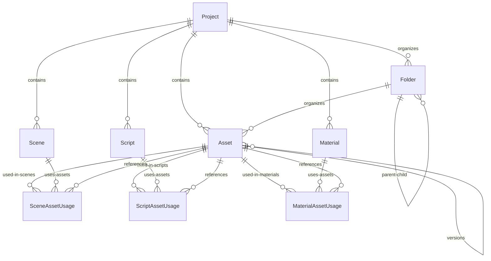

# QAQ游戏引擎 - 资源管理系统设计详解

## 📋 概述

QAQ游戏引擎的资源管理系统采用了现代化的关系型数据库设计，支持完整的资源生命周期管理、版本控制、依赖追踪和使用情况分析。

## 🗄️ 1. 资源与其他实体的关联关系设计

### **核心实体关系图**



### **资源实体核心结构**

```typescript
// Asset 核心数据模型
interface Asset {
  // 基础标识
  id: string
  name: string
  type: AssetType
  filePath: string        // 项目内相对路径
  fileSize: number        // 文件大小（字节）
  mimeType?: string       // MIME类型
  checksum?: string       // 文件完整性校验

  // 媒体元数据
  width?: number          // 图片/视频宽度
  height?: number         // 图片/视频高度
  duration?: number       // 音频/视频时长（秒）
  channels?: number       // 音频声道数
  sampleRate?: number     // 音频采样率
  bitRate?: number        // 音频/视频比特率

  // 组织结构
  projectId: string       // 所属项目
  folderId?: string       // 所属文件夹
  tags?: string[]         // 标签（JSON存储）

  // 版本控制
  version: string         // 版本号
  parentId?: string       // 父版本ID
  dependencies?: string[] // 依赖资源ID列表

  // 导入信息
  originalName?: string   // 原始文件名
  importedAt: Date        // 导入时间
  importSettings?: any    // 导入配置

  // 预览
  thumbnail?: string      // 缩略图路径
  preview?: string        // 预览文件路径

  // 时间戳
  createdAt: Date
  updatedAt: Date
}

// 支持的资源类型
enum AssetType {
  TEXTURE = "TEXTURE",     // 纹理贴图
  MODEL = "MODEL",         // 3D模型
  AUDIO = "AUDIO",         // 音频文件
  VIDEO = "VIDEO",         // 视频文件
  SCRIPT = "SCRIPT",       // 脚本文件
  SHADER = "SHADER",       // 着色器
  MATERIAL = "MATERIAL",   // 材质定义
  ANIMATION = "ANIMATION", // 动画数据
  FONT = "FONT",          // 字体文件
  DATA = "DATA",          // 数据文件
  SCENE = "SCENE",        // 场景文件
  PREFAB = "PREFAB",      // 预制体
  PLUGIN = "PLUGIN",      // 插件
  DOCUMENT = "DOCUMENT",  // 文档
  OTHER = "OTHER"         // 其他类型
}
```

## 🔗 2. 资源使用情况数据模型

### **使用情况追踪系统**

资源使用情况通过三个专门的关联表进行追踪，实现了多对多关系的精确管理：

#### **场景资源使用 (SceneAssetUsage)**
```typescript
interface SceneAssetUsage {
  id: string
  sceneId: string         // 场景ID
  assetId: string         // 资源ID
  usage: string           // 使用方式

  // 关联关系
  scene: Scene
  asset: Asset
}

// 使用方式示例
const SceneUsageTypes = {
  TEXTURE: "texture",           // 作为纹理使用
  MODEL: "model",              // 作为3D模型使用
  AUDIO: "audio",              // 作为音频源使用
  SKYBOX: "skybox",            // 作为天空盒使用
  ENVIRONMENT: "environment",   // 作为环境贴图使用
  PARTICLE: "particle",        // 粒子系统使用
  LIGHTING: "lighting",        // 光照贴图使用
  COLLISION: "collision"       // 碰撞网格使用
}
```

#### **脚本资源使用 (ScriptAssetUsage)**
```typescript
interface ScriptAssetUsage {
  id: string
  scriptId: string        // 脚本ID
  assetId: string         // 资源ID
  usage: string           // 使用方式

  // 关联关系
  script: Script
  asset: Asset
}

// 使用方式示例
const ScriptUsageTypes = {
  IMPORT: "import",             // 导入引用
  REFERENCE: "reference",       // 直接引用
  DYNAMIC_LOAD: "dynamic_load", // 动态加载
  PRELOAD: "preload",          // 预加载
  RESOURCE_PATH: "resource_path" // 资源路径引用
}
```

#### **材质资源使用 (MaterialAssetUsage)**
```typescript
interface MaterialAssetUsage {
  id: string
  materialId: string      // 材质ID
  assetId: string         // 资源ID
  usage: string           // 使用方式

  // 关联关系
  material: Material
  asset: Asset
}

// 使用方式示例
const MaterialUsageTypes = {
  DIFFUSE: "diffuse",           // 漫反射贴图
  NORMAL: "normal",             // 法线贴图
  ROUGHNESS: "roughness",       // 粗糙度贴图
  METALLIC: "metallic",         // 金属度贴图
  SPECULAR: "specular",         // 镜面反射贴图
  EMISSION: "emission",         // 自发光贴图
  OCCLUSION: "occlusion",       // 环境光遮蔽贴图
  HEIGHT: "height",             // 高度贴图
  OPACITY: "opacity",           // 透明度贴图
  SUBSURFACE: "subsurface"      // 次表面散射贴图
}
```

### **使用情况查询示例**

```typescript
// 查询资源的所有使用情况
async function getAssetUsage(assetId: string) {
  const asset = await prisma.asset.findUnique({
    where: { id: assetId },
    include: {
      sceneUsages: {
        include: { scene: { select: { name: true, path: true } } }
      },
      scriptUsages: {
        include: { script: { select: { name: true, path: true } } }
      },
      materialUsages: {
        include: { material: { select: { name: true } } }
      }
    }
  })

  return {
    asset,
    usageCount: {
      scenes: asset.sceneUsages.length,
      scripts: asset.scriptUsages.length,
      materials: asset.materialUsages.length,
      total: asset.sceneUsages.length + asset.scriptUsages.length + asset.materialUsages.length
    },
    usageDetails: {
      scenes: asset.sceneUsages.map(usage => ({
        scene: usage.scene.name,
        path: usage.scene.path,
        usage: usage.usage
      })),
      scripts: asset.scriptUsages.map(usage => ({
        script: usage.script.name,
        path: usage.script.path,
        usage: usage.usage
      })),
      materials: asset.materialUsages.map(usage => ({
        material: usage.material.name,
        usage: usage.usage
      }))
    }
  }
}

// 查找未使用的资源
async function findUnusedAssets(projectId: string) {
  return await prisma.asset.findMany({
    where: {
      projectId,
      AND: [
        { sceneUsages: { none: {} } },
        { scriptUsages: { none: {} } },
        { materialUsages: { none: {} } }
      ]
    },
    select: {
      id: true,
      name: true,
      type: true,
      filePath: true,
      fileSize: true,
      createdAt: true
    }
  })
}

// 查找资源依赖链
async function getAssetDependencyChain(assetId: string) {
  const asset = await prisma.asset.findUnique({
    where: { id: assetId },
    include: {
      versions: true,  // 子版本
      parent: true     // 父版本
    }
  })

  // 解析依赖关系
  const dependencies = asset.dependencies ? JSON.parse(asset.dependencies) : []
  const dependentAssets = await prisma.asset.findMany({
    where: { id: { in: dependencies } },
    select: { id: true, name: true, type: true, version: true }
  })

  return {
    asset,
    dependencies: dependentAssets,
    versions: asset.versions,
    parent: asset.parent
  }
}
```

## 🔄 3. 版本控制和依赖管理

### **版本控制系统设计**

```typescript
// 版本控制接口
interface AssetVersionControl {
  // 创建新版本
  createVersion(assetId: string, changes: Partial<Asset>): Promise<Asset>

  // 获取版本历史
  getVersionHistory(assetId: string): Promise<Asset[]>

  // 版本回滚
  rollbackToVersion(assetId: string, targetVersionId: string): Promise<Asset>

  // 版本比较
  compareVersions(version1Id: string, version2Id: string): Promise<VersionDiff>
}

// 版本管理实现
class AssetVersionManager implements AssetVersionControl {
  async createVersion(assetId: string, changes: Partial<Asset>): Promise<Asset> {
    const originalAsset = await prisma.asset.findUnique({
      where: { id: assetId }
    })

    if (!originalAsset) {
      throw new Error('原始资源不存在')
    }

    // 生成新版本号
    const newVersion = this.incrementVersion(originalAsset.version)

    // 创建新版本资源
    const newAsset = await prisma.asset.create({
      data: {
        ...originalAsset,
        ...changes,
        id: undefined, // 生成新ID
        version: newVersion,
        parentId: assetId, // 指向原始资源
        createdAt: new Date(),
        updatedAt: new Date()
      }
    })

    return newAsset
  }

  async getVersionHistory(assetId: string): Promise<Asset[]> {
    // 获取所有版本（包括子版本和父版本）
    const asset = await prisma.asset.findUnique({
      where: { id: assetId },
      include: {
        versions: {
          orderBy: { createdAt: 'desc' }
        },
        parent: {
          include: {
            versions: {
              orderBy: { createdAt: 'desc' }
            }
          }
        }
      }
    })

    if (!asset) return []

    // 构建完整版本链
    const allVersions = []

    // 添加父版本链
    let currentParent = asset.parent
    while (currentParent) {
      allVersions.push(currentParent)
      currentParent = currentParent.parent
    }

    // 添加当前版本
    allVersions.push(asset)

    // 添加子版本
    allVersions.push(...asset.versions)

    return allVersions.sort((a, b) =>
      new Date(b.createdAt).getTime() - new Date(a.createdAt).getTime()
    )
  }

  private incrementVersion(currentVersion: string): string {
    const parts = currentVersion.split('.').map(Number)
    parts[2] = (parts[2] || 0) + 1 // 增加补丁版本号
    return parts.join('.')
  }
}
```

### **依赖管理系统**

```typescript
// 依赖管理接口
interface AssetDependencyManager {
  // 添加依赖
  addDependency(assetId: string, dependencyId: string): Promise<void>

  // 移除依赖
  removeDependency(assetId: string, dependencyId: string): Promise<void>

  // 获取依赖树
  getDependencyTree(assetId: string): Promise<DependencyTree>

  // 检查循环依赖
  checkCircularDependency(assetId: string, dependencyId: string): Promise<boolean>

  // 获取影响分析
  getImpactAnalysis(assetId: string): Promise<ImpactAnalysis>
}

interface DependencyTree {
  asset: Asset
  dependencies: DependencyTree[]
  dependents: Asset[]
}

interface ImpactAnalysis {
  directDependents: Asset[]
  indirectDependents: Asset[]
  affectedScenes: Scene[]
  affectedScripts: Script[]
  affectedMaterials: Material[]
}

// 依赖管理实现
class AssetDependencyManager implements AssetDependencyManager {
  async addDependency(assetId: string, dependencyId: string): Promise<void> {
    // 检查循环依赖
    const hasCircular = await this.checkCircularDependency(assetId, dependencyId)
    if (hasCircular) {
      throw new Error('检测到循环依赖，无法添加')
    }

    const asset = await prisma.asset.findUnique({
      where: { id: assetId }
    })

    if (!asset) {
      throw new Error('资源不存在')
    }

    const currentDeps = asset.dependencies ? JSON.parse(asset.dependencies) : []

    if (!currentDeps.includes(dependencyId)) {
      currentDeps.push(dependencyId)

      await prisma.asset.update({
        where: { id: assetId },
        data: {
          dependencies: JSON.stringify(currentDeps),
          updatedAt: new Date()
        }
      })
    }
  }

  async getDependencyTree(assetId: string): Promise<DependencyTree> {
    const asset = await prisma.asset.findUnique({
      where: { id: assetId }
    })

    if (!asset) {
      throw new Error('资源不存在')
    }

    const dependencies = asset.dependencies ? JSON.parse(asset.dependencies) : []

    // 递归构建依赖树
    const dependencyTrees = await Promise.all(
      dependencies.map(depId => this.getDependencyTree(depId))
    )

    // 查找依赖于当前资源的其他资源
    const dependents = await prisma.asset.findMany({
      where: {
        dependencies: {
          contains: assetId
        }
      }
    })

    return {
      asset,
      dependencies: dependencyTrees,
      dependents
    }
  }

  async checkCircularDependency(assetId: string, dependencyId: string): Promise<boolean> {
    const visited = new Set<string>()

    const checkCircular = async (currentId: string, targetId: string): Promise<boolean> => {
      if (currentId === targetId) return true
      if (visited.has(currentId)) return false

      visited.add(currentId)

      const asset = await prisma.asset.findUnique({
        where: { id: currentId }
      })

      if (!asset || !asset.dependencies) return false

      const deps = JSON.parse(asset.dependencies)

      for (const depId of deps) {
        if (await checkCircular(depId, targetId)) {
          return true
        }
      }

      return false
    }

    return await checkCircular(dependencyId, assetId)
  }

  async getImpactAnalysis(assetId: string): Promise<ImpactAnalysis> {
    // 直接依赖者
    const directDependents = await prisma.asset.findMany({
      where: {
        dependencies: {
          contains: assetId
        }
      }
    })

    // 间接依赖者（递归查找）
    const indirectDependents = []
    for (const dependent of directDependents) {
      const subDependents = await this.getImpactAnalysis(dependent.id)
      indirectDependents.push(...subDependents.directDependents)
    }

    // 受影响的场景
    const affectedScenes = await prisma.scene.findMany({
      where: {
        assetUsages: {
          some: { assetId }
        }
      }
    })

    // 受影响的脚本
    const affectedScripts = await prisma.script.findMany({
      where: {
        assetUsages: {
          some: { assetId }
        }
      }
    })

    // 受影响的材质
    const affectedMaterials = await prisma.material.findMany({
      where: {
        assetUsages: {
          some: { assetId }
        }
      }
    })

    return {
      directDependents,
      indirectDependents: [...new Set(indirectDependents)], // 去重
      affectedScenes,
      affectedScripts,
      affectedMaterials
    }
  }
}
```

## 📁 4. 数据库层面的组织关系

### **项目-文件夹-资源层次结构**

```sql
-- 项目表：顶级容器
CREATE TABLE projects (
    id TEXT PRIMARY KEY,
    name TEXT NOT NULL,
    path TEXT NOT NULL UNIQUE,
    user_id TEXT NOT NULL,
    created_at DATETIME DEFAULT CURRENT_TIMESTAMP,
    FOREIGN KEY (user_id) REFERENCES users(id)
);

-- 文件夹表：组织结构
CREATE TABLE folders (
    id TEXT PRIMARY KEY,
    name TEXT NOT NULL,
    project_id TEXT NOT NULL,
    parent_id TEXT, -- 自引用，支持嵌套文件夹
    path TEXT NOT NULL, -- 完整路径
    created_at DATETIME DEFAULT CURRENT_TIMESTAMP,

    FOREIGN KEY (project_id) REFERENCES projects(id) ON DELETE CASCADE,
    FOREIGN KEY (parent_id) REFERENCES folders(id) ON DELETE CASCADE,

    UNIQUE(project_id, path)
);

-- 资源表：实际文件资源
CREATE TABLE assets (
    id TEXT PRIMARY KEY,
    name TEXT NOT NULL,
    type TEXT NOT NULL, -- AssetType枚举
    file_path TEXT NOT NULL, -- 项目内相对路径
    file_size INTEGER NOT NULL,
    project_id TEXT NOT NULL,
    folder_id TEXT, -- 可选，资源可以在根目录

    -- 版本控制
    version TEXT DEFAULT '1.0.0',
    parent_id TEXT, -- 指向父版本
    dependencies TEXT, -- JSON数组，依赖的资源ID

    created_at DATETIME DEFAULT CURRENT_TIMESTAMP,
    updated_at DATETIME DEFAULT CURRENT_TIMESTAMP,

    FOREIGN KEY (project_id) REFERENCES projects(id) ON DELETE CASCADE,
    FOREIGN KEY (folder_id) REFERENCES folders(id) ON DELETE SET NULL,
    FOREIGN KEY (parent_id) REFERENCES assets(id),

    UNIQUE(project_id, file_path)
);

-- 索引优化
CREATE INDEX idx_assets_project_type ON assets(project_id, type);
CREATE INDEX idx_assets_project_folder ON assets(project_id, folder_id);
CREATE INDEX idx_assets_parent ON assets(parent_id);
CREATE INDEX idx_folders_project_parent ON folders(project_id, parent_id);
```

### **查询示例**

```typescript
// 获取项目的完整资源树
async function getProjectAssetTree(projectId: string) {
  const project = await prisma.project.findUnique({
    where: { id: projectId },
    include: {
      folders: {
        include: {
          assets: {
            select: {
              id: true,
              name: true,
              type: true,
              fileSize: true,
              version: true,
              createdAt: true
            }
          },
          children: {
            include: {
              assets: true
            }
          }
        },
        where: { parentId: null } // 只获取根文件夹
      },
      assets: {
        where: { folderId: null }, // 根目录下的资源
        select: {
          id: true,
          name: true,
          type: true,
          fileSize: true,
          version: true,
          createdAt: true
        }
      }
    }
  })

  return project
}

// 获取文件夹的层次路径
async function getFolderPath(folderId: string): Promise<string> {
  const folder = await prisma.folder.findUnique({
    where: { id: folderId },
    include: { parent: true }
  })

  if (!folder) return ''

  if (!folder.parent) {
    return folder.name
  }

  const parentPath = await getFolderPath(folder.parent.id)
  return `${parentPath}/${folder.name}`
}

// 移动资源到不同文件夹
async function moveAsset(assetId: string, targetFolderId: string | null) {
  const asset = await prisma.asset.findUnique({
    where: { id: assetId }
  })

  if (!asset) {
    throw new Error('资源不存在')
  }

  // 构建新的文件路径
  let newPath = asset.filePath
  if (targetFolderId) {
    const targetFolder = await prisma.folder.findUnique({
      where: { id: targetFolderId }
    })

    if (!targetFolder) {
      throw new Error('目标文件夹不存在')
    }

    const folderPath = await getFolderPath(targetFolderId)
    const fileName = path.basename(asset.filePath)
    newPath = `${folderPath}/${fileName}`
  }

  // 更新资源记录
  await prisma.asset.update({
    where: { id: assetId },
    data: {
      folderId: targetFolderId,
      filePath: newPath,
      updatedAt: new Date()
    }
  })

  return { success: true, newPath }
}
```

## 🔄 5. 资源导入、更新和删除的完整流程

### **资源导入流程**

```typescript
// 资源导入服务
class AssetImportService {
  async importAsset(
    projectId: string,
    file: File,
    options: ImportOptions
  ): Promise<ImportResult> {

    // 1. 验证文件
    const validation = await this.validateFile(file, options)
    if (!validation.isValid) {
      throw new Error(`文件验证失败: ${validation.errors.join(', ')}`)
    }

    // 2. 生成文件路径和元数据
    const metadata = await this.extractMetadata(file)
    const filePath = this.generateFilePath(projectId, file.name, options.targetFolder)

    // 3. 处理文件（转换、优化等）
    const processedFile = await this.processFile(file, metadata, options)

    // 4. 保存到文件系统
    const savedPath = await this.saveToFileSystem(processedFile, filePath)

    // 5. 生成缩略图和预览
    const thumbnails = await this.generateThumbnails(savedPath, metadata)

    // 6. 创建数据库记录
    const asset = await this.createAssetRecord({
      projectId,
      file: processedFile,
      metadata,
      filePath: savedPath,
      thumbnails,
      options
    })

    // 7. 处理依赖关系
    if (options.dependencies?.length > 0) {
      await this.processDependencies(asset.id, options.dependencies)
    }

    // 8. 触发后处理事件
    await this.triggerPostImportEvents(asset)

    return {
      success: true,
      asset,
      warnings: validation.warnings || []
    }
  }

  private async validateFile(file: File, options: ImportOptions): Promise<ValidationResult> {
    const errors: string[] = []
    const warnings: string[] = []

    // 文件大小检查
    const maxSize = this.getMaxFileSize(file.type)
    if (file.size > maxSize) {
      errors.push(`文件大小超过限制 (${this.formatFileSize(maxSize)})`)
    }

    // 文件类型检查
    const supportedTypes = this.getSupportedFileTypes()
    if (!supportedTypes.includes(file.type)) {
      errors.push(`不支持的文件类型: ${file.type}`)
    }

    // 文件名检查
    const nameRegex = /^[a-zA-Z0-9\-_\.\s\u4e00-\u9fa5]+$/
    if (!nameRegex.test(file.name)) {
      errors.push('文件名包含无效字符')
    }

    // 重复文件检查
    const existingAsset = await this.checkDuplicateFile(file, options.projectId)
    if (existingAsset) {
      if (options.overwrite) {
        warnings.push(`将覆盖现有文件: ${existingAsset.name}`)
      } else {
        errors.push(`文件已存在: ${existingAsset.name}`)
      }
    }

    return {
      isValid: errors.length === 0,
      errors,
      warnings
    }
  }

  private async extractMetadata(file: File): Promise<AssetMetadata> {
    const metadata: AssetMetadata = {
      originalName: file.name,
      mimeType: file.type,
      fileSize: file.size,
      checksum: await this.calculateChecksum(file)
    }

    // 根据文件类型提取特定元数据
    if (file.type.startsWith('image/')) {
      const imageData = await this.extractImageMetadata(file)
      metadata.width = imageData.width
      metadata.height = imageData.height
    } else if (file.type.startsWith('audio/')) {
      const audioData = await this.extractAudioMetadata(file)
      metadata.duration = audioData.duration
      metadata.channels = audioData.channels
      metadata.sampleRate = audioData.sampleRate
      metadata.bitRate = audioData.bitRate
    } else if (file.type.startsWith('video/')) {
      const videoData = await this.extractVideoMetadata(file)
      metadata.width = videoData.width
      metadata.height = videoData.height
      metadata.duration = videoData.duration
      metadata.bitRate = videoData.bitRate
    }

    return metadata
  }

  private async processFile(
    file: File,
    metadata: AssetMetadata,
    options: ImportOptions
  ): Promise<ProcessedFile> {

    let processedFile = file

    // 图片处理
    if (file.type.startsWith('image/') && options.imageProcessing) {
      processedFile = await this.processImage(file, options.imageProcessing)
    }

    // 音频处理
    if (file.type.startsWith('audio/') && options.audioProcessing) {
      processedFile = await this.processAudio(file, options.audioProcessing)
    }

    // 模型处理
    if (this.is3DModel(file.type) && options.modelProcessing) {
      processedFile = await this.processModel(file, options.modelProcessing)
    }

    return {
      file: processedFile,
      originalFile: file,
      processingApplied: processedFile !== file
    }
  }

  private async createAssetRecord(params: CreateAssetParams): Promise<Asset> {
    const {
      projectId,
      file,
      metadata,
      filePath,
      thumbnails,
      options
    } = params

    const assetType = this.determineAssetType(file.file.type, file.file.name)

    return await prisma.asset.create({
      data: {
        name: options.customName || this.extractFileName(file.file.name),
        type: assetType,
        filePath,
        fileSize: file.file.size,
        mimeType: file.file.type,
        checksum: metadata.checksum,

        // 媒体元数据
        width: metadata.width,
        height: metadata.height,
        duration: metadata.duration,
        channels: metadata.channels,
        sampleRate: metadata.sampleRate,
        bitRate: metadata.bitRate,

        // 组织信息
        projectId,
        folderId: options.targetFolder,
        tags: options.tags ? JSON.stringify(options.tags) : null,

        // 导入信息
        originalName: metadata.originalName,
        importedAt: new Date(),
        importSettings: JSON.stringify(options),

        // 预览文件
        thumbnail: thumbnails.thumbnail,
        preview: thumbnails.preview,

        // 版本信息
        version: '1.0.0'
      }
    })
  }
}

// 导入选项接口
interface ImportOptions {
  projectId: string
  targetFolder?: string
  customName?: string
  tags?: string[]
  overwrite?: boolean
  dependencies?: string[]

  // 处理选项
  imageProcessing?: ImageProcessingOptions
  audioProcessing?: AudioProcessingOptions
  modelProcessing?: ModelProcessingOptions
}

interface ImageProcessingOptions {
  resize?: { width: number; height: number }
  format?: 'png' | 'jpg' | 'webp'
  quality?: number
  generateMipmaps?: boolean
}

interface AudioProcessingOptions {
  format?: 'mp3' | 'ogg' | 'wav'
  bitRate?: number
  normalize?: boolean
  trim?: { start: number; end: number }
}

interface ModelProcessingOptions {
  scale?: number
  centerPivot?: boolean
  generateLODs?: boolean
  optimizeMesh?: boolean
  bakeLighting?: boolean
}
```

### **资源更新流程**

```typescript
// 资源更新服务
class AssetUpdateService {
  async updateAsset(
    assetId: string,
    updates: AssetUpdateData,
    options: UpdateOptions = {}
  ): Promise<UpdateResult> {

    // 1. 获取当前资源
    const currentAsset = await prisma.asset.findUnique({
      where: { id: assetId },
      include: {
        sceneUsages: true,
        scriptUsages: true,
        materialUsages: true
      }
    })

    if (!currentAsset) {
      throw new Error('资源不存在')
    }

    // 2. 检查更新权限
    await this.checkUpdatePermissions(currentAsset, options.userId)

    // 3. 创建版本备份（如果需要）
    let backupVersion: Asset | null = null
    if (options.createBackup) {
      backupVersion = await this.createVersionBackup(currentAsset)
    }

    // 4. 处理文件更新
    let fileUpdateResult: FileUpdateResult | null = null
    if (updates.newFile) {
      fileUpdateResult = await this.updateAssetFile(currentAsset, updates.newFile, options)
    }

    // 5. 更新元数据
    const updatedAsset = await this.updateAssetMetadata(currentAsset, updates, fileUpdateResult)

    // 6. 更新依赖关系
    if (updates.dependencies !== undefined) {
      await this.updateDependencies(assetId, updates.dependencies)
    }

    // 7. 通知依赖者
    const impactAnalysis = await this.analyzeUpdateImpact(currentAsset, updates)
    await this.notifyDependents(impactAnalysis)

    // 8. 触发更新事件
    await this.triggerUpdateEvents(updatedAsset, currentAsset, impactAnalysis)

    return {
      success: true,
      asset: updatedAsset,
      backup: backupVersion,
      impact: impactAnalysis,
      fileUpdated: !!fileUpdateResult
    }
  }

  private async updateAssetFile(
    asset: Asset,
    newFile: File,
    options: UpdateOptions
  ): Promise<FileUpdateResult> {

    // 1. 验证新文件
    const validation = await this.validateFileUpdate(asset, newFile)
    if (!validation.isValid) {
      throw new Error(`文件更新验证失败: ${validation.errors.join(', ')}`)
    }

    // 2. 备份原文件
    const backupPath = await this.backupOriginalFile(asset.filePath)

    try {
      // 3. 处理新文件
      const metadata = await this.extractMetadata(newFile)
      const processedFile = await this.processFile(newFile, metadata, options.processing || {})

      // 4. 替换文件
      await this.replaceFile(asset.filePath, processedFile.file)

      // 5. 更新缩略图和预览
      const thumbnails = await this.regenerateThumbnails(asset.filePath, metadata)

      // 6. 清理备份（如果成功）
      if (!options.keepBackup) {
        await this.cleanupBackup(backupPath)
      }

      return {
        success: true,
        metadata,
        thumbnails,
        backupPath: options.keepBackup ? backupPath : null
      }

    } catch (error) {
      // 恢复原文件
      await this.restoreFromBackup(asset.filePath, backupPath)
      throw error
    }
  }

  private async analyzeUpdateImpact(
    asset: Asset,
    updates: AssetUpdateData
  ): Promise<UpdateImpactAnalysis> {

    const impact: UpdateImpactAnalysis = {
      affectedScenes: [],
      affectedScripts: [],
      affectedMaterials: [],
      dependentAssets: [],
      breakingChanges: [],
      warnings: []
    }

    // 分析文件类型变化
    if (updates.newFile && updates.newFile.type !== asset.mimeType) {
      impact.breakingChanges.push({
        type: 'FILE_TYPE_CHANGE',
        description: `文件类型从 ${asset.mimeType} 变更为 ${updates.newFile.type}`,
        severity: 'HIGH'
      })
    }

    // 分析尺寸变化（对图片/视频）
    if (updates.metadata?.width && updates.metadata.width !== asset.width) {
      impact.warnings.push({
        type: 'DIMENSION_CHANGE',
        description: `图片宽度从 ${asset.width} 变更为 ${updates.metadata.width}`,
        severity: 'MEDIUM'
      })
    }

    // 查找受影响的场景
    impact.affectedScenes = await prisma.scene.findMany({
      where: {
        assetUsages: {
          some: { assetId: asset.id }
        }
      },
      include: {
        assetUsages: {
          where: { assetId: asset.id }
        }
      }
    })

    // 查找受影响的脚本
    impact.affectedScripts = await prisma.script.findMany({
      where: {
        assetUsages: {
          some: { assetId: asset.id }
        }
      }
    })

    // 查找受影响的材质
    impact.affectedMaterials = await prisma.material.findMany({
      where: {
        assetUsages: {
          some: { assetId: asset.id }
        }
      }
    })

    // 查找依赖此资源的其他资源
    impact.dependentAssets = await prisma.asset.findMany({
      where: {
        dependencies: {
          contains: asset.id
        }
      }
    })

    return impact
  }
}

// 更新相关接口
interface AssetUpdateData {
  name?: string
  newFile?: File
  tags?: string[]
  metadata?: Partial<AssetMetadata>
  dependencies?: string[]
}

interface UpdateOptions {
  userId?: string
  createBackup?: boolean
  keepBackup?: boolean
  processing?: ProcessingOptions
  notifyDependents?: boolean
}

interface UpdateImpactAnalysis {
  affectedScenes: Scene[]
  affectedScripts: Script[]
  affectedMaterials: Material[]
  dependentAssets: Asset[]
  breakingChanges: BreakingChange[]
  warnings: Warning[]
}

interface BreakingChange {
  type: string
  description: string
  severity: 'LOW' | 'MEDIUM' | 'HIGH' | 'CRITICAL'
}
```

### **资源删除流程**

```typescript
// 资源删除服务
class AssetDeletionService {
  async deleteAsset(
    assetId: string,
    options: DeletionOptions = {}
  ): Promise<DeletionResult> {

    // 1. 获取资源信息
    const asset = await prisma.asset.findUnique({
      where: { id: assetId },
      include: {
        sceneUsages: { include: { scene: true } },
        scriptUsages: { include: { script: true } },
        materialUsages: { include: { material: true } },
        versions: true,
        parent: true
      }
    })

    if (!asset) {
      throw new Error('资源不存在')
    }

    // 2. 检查删除权限
    await this.checkDeletionPermissions(asset, options.userId)

    // 3. 分析删除影响
    const impactAnalysis = await this.analyzeDeletionImpact(asset)

    // 4. 处理强制删除或用户确认
    if (!options.force && impactAnalysis.hasUsages) {
      if (!options.confirmed) {
        return {
          success: false,
          requiresConfirmation: true,
          impact: impactAnalysis,
          message: '资源正在被使用，需要确认删除'
        }
      }
    }

    // 5. 处理依赖关系
    await this.handleDependenciesBeforeDeletion(asset, options)

    // 6. 创建删除备份（如果需要）
    let backup: AssetBackup | null = null
    if (options.createBackup) {
      backup = await this.createDeletionBackup(asset)
    }

    // 7. 执行删除操作
    const deletionSteps = await this.executeDeletion(asset, options)

    // 8. 清理相关数据
    await this.cleanupRelatedData(asset, options)

    // 9. 触发删除事件
    await this.triggerDeletionEvents(asset, impactAnalysis)

    return {
      success: true,
      deletedAsset: asset,
      impact: impactAnalysis,
      backup,
      steps: deletionSteps
    }
  }

  private async analyzeDeletionImpact(asset: Asset): Promise<DeletionImpactAnalysis> {
    const impact: DeletionImpactAnalysis = {
      hasUsages: false,
      usageCount: 0,
      affectedEntities: {
        scenes: asset.sceneUsages || [],
        scripts: asset.scriptUsages || [],
        materials: asset.materialUsages || []
      },
      dependentAssets: [],
      versionChain: [],
      canSafelyDelete: true,
      warnings: [],
      blockers: []
    }

    // 计算使用情况
    impact.usageCount =
      (asset.sceneUsages?.length || 0) +
      (asset.scriptUsages?.length || 0) +
      (asset.materialUsages?.length || 0)

    impact.hasUsages = impact.usageCount > 0

    // 查找依赖此资源的其他资源
    impact.dependentAssets = await prisma.asset.findMany({
      where: {
        dependencies: {
          contains: asset.id
        }
      }
    })

    // 分析版本链
    if (asset.versions && asset.versions.length > 0) {
      impact.versionChain = asset.versions
      impact.warnings.push({
        type: 'VERSION_CHAIN',
        message: `此资源有 ${asset.versions.length} 个子版本，删除将影响版本历史`,
        severity: 'MEDIUM'
      })
    }

    // 检查是否为其他资源的父版本
    if (asset.parent) {
      impact.warnings.push({
        type: 'PARENT_VERSION',
        message: '此资源是某个版本的子版本，删除可能影响版本链',
        severity: 'LOW'
      })
    }

    // 检查关键资源
    if (this.isCriticalAsset(asset)) {
      impact.blockers.push({
        type: 'CRITICAL_ASSET',
        message: '此资源被标记为关键资源，不能删除',
        severity: 'CRITICAL'
      })
      impact.canSafelyDelete = false
    }

    // 检查依赖资源
    if (impact.dependentAssets.length > 0) {
      impact.warnings.push({
        type: 'DEPENDENT_ASSETS',
        message: `有 ${impact.dependentAssets.length} 个资源依赖此资源`,
        severity: 'HIGH'
      })
    }

    return impact
  }

  private async executeDeletion(
    asset: Asset,
    options: DeletionOptions
  ): Promise<DeletionStep[]> {

    const steps: DeletionStep[] = []

    try {
      // 1. 删除使用关系
      if (options.removeUsages) {
        await prisma.sceneAssetUsage.deleteMany({
          where: { assetId: asset.id }
        })
        await prisma.scriptAssetUsage.deleteMany({
          where: { assetId: asset.id }
        })
        await prisma.materialAssetUsage.deleteMany({
          where: { assetId: asset.id }
        })

        steps.push({
          type: 'REMOVE_USAGES',
          description: '删除资源使用关系',
          success: true
        })
      }

      // 2. 处理依赖关系
      if (options.updateDependents) {
        const dependentAssets = await prisma.asset.findMany({
          where: {
            dependencies: {
              contains: asset.id
            }
          }
        })

        for (const dependent of dependentAssets) {
          const deps = JSON.parse(dependent.dependencies || '[]')
          const updatedDeps = deps.filter((id: string) => id !== asset.id)

          await prisma.asset.update({
            where: { id: dependent.id },
            data: {
              dependencies: JSON.stringify(updatedDeps),
              updatedAt: new Date()
            }
          })
        }

        steps.push({
          type: 'UPDATE_DEPENDENCIES',
          description: `更新 ${dependentAssets.length} 个依赖资源`,
          success: true
        })
      }

      // 3. 删除版本链（如果需要）
      if (options.deleteVersionChain && asset.versions) {
        for (const version of asset.versions) {
          await this.deleteAsset(version.id, {
            ...options,
            deleteVersionChain: false // 避免递归
          })
        }

        steps.push({
          type: 'DELETE_VERSIONS',
          description: `删除 ${asset.versions.length} 个版本`,
          success: true
        })
      }

      // 4. 删除物理文件
      if (options.deleteFiles) {
        await this.deletePhysicalFiles(asset)

        steps.push({
          type: 'DELETE_FILES',
          description: '删除物理文件',
          success: true
        })
      }

      // 5. 删除数据库记录
      await prisma.asset.delete({
        where: { id: asset.id }
      })

      steps.push({
        type: 'DELETE_RECORD',
        description: '删除数据库记录',
        success: true
      })

    } catch (error) {
      steps.push({
        type: 'ERROR',
        description: `删除失败: ${error.message}`,
        success: false,
        error: error.message
      })

      throw error
    }

    return steps
  }

  private async deletePhysicalFiles(asset: Asset): Promise<void> {
    const fs = await import('fs/promises')
    const path = await import('path')

    try {
      // 删除主文件
      await fs.unlink(asset.filePath)

      // 删除缩略图
      if (asset.thumbnail) {
        await fs.unlink(asset.thumbnail).catch(() => {}) // 忽略错误
      }

      // 删除预览文件
      if (asset.preview) {
        await fs.unlink(asset.preview).catch(() => {}) // 忽略错误
      }

    } catch (error) {
      console.warn(`删除物理文件失败: ${error.message}`)
      // 不抛出错误，允许继续删除数据库记录
    }
  }
}

// 删除相关接口
interface DeletionOptions {
  userId?: string
  force?: boolean
  confirmed?: boolean
  createBackup?: boolean
  removeUsages?: boolean
  updateDependents?: boolean
  deleteVersionChain?: boolean
  deleteFiles?: boolean
}

interface DeletionImpactAnalysis {
  hasUsages: boolean
  usageCount: number
  affectedEntities: {
    scenes: SceneAssetUsage[]
    scripts: ScriptAssetUsage[]
    materials: MaterialAssetUsage[]
  }
  dependentAssets: Asset[]
  versionChain: Asset[]
  canSafelyDelete: boolean
  warnings: Warning[]
  blockers: Blocker[]
}

interface DeletionStep {
  type: string
  description: string
  success: boolean
  error?: string
}
```

---

**文档版本**: 1.0.0
**最后更新**: 2024年7月15日
**适用于**: QAQ游戏引擎 v1.0.0
