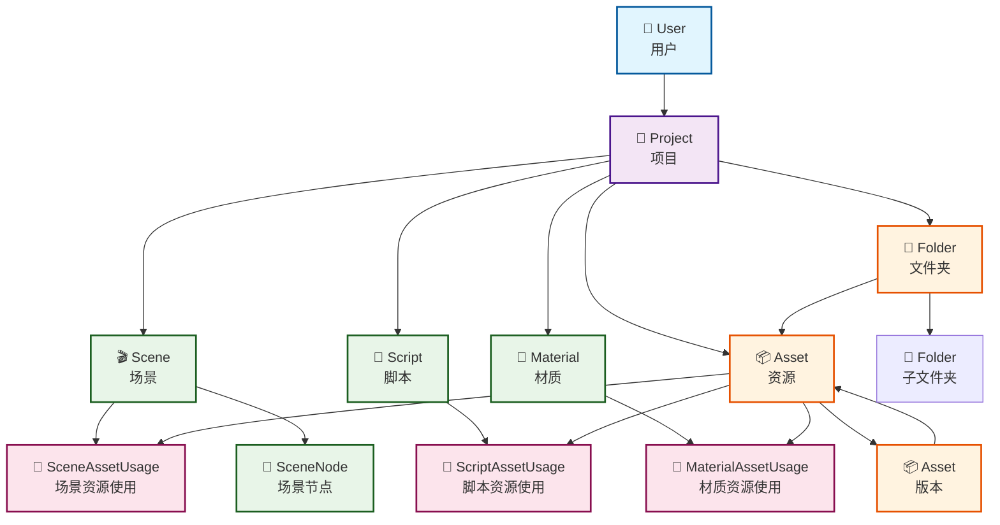
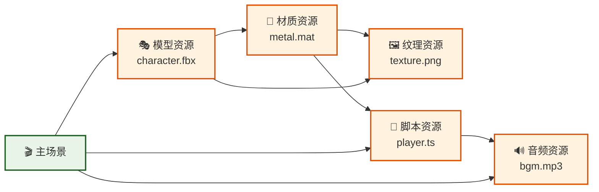

# QAQ游戏引擎 - 资源管理系统实例和API示例

## 📊 数据库关系图

### **完整实体关系图**



### **资源依赖关系图**



## 🔧 API使用示例

### **1. 资源导入API示例**

```typescript
// POST /api/assets/import
const importAsset = async (projectId: string, file: File) => {
  const formData = new FormData()
  formData.append('file', file)
  formData.append('projectId', projectId)
  formData.append('options', JSON.stringify({
    targetFolder: 'textures',
    tags: ['environment', 'outdoor'],
    imageProcessing: {
      generateMipmaps: true,
      format: 'webp',
      quality: 85
    }
  }))
  
  const response = await fetch('/api/assets/import', {
    method: 'POST',
    headers: {
      'Authorization': `Bearer ${token}`
    },
    body: formData
  })
  
  return await response.json()
}

// 响应示例
{
  "success": true,
  "asset": {
    "id": "clxxx123",
    "name": "forest_texture",
    "type": "TEXTURE",
    "filePath": "textures/forest_texture.webp",
    "fileSize": 2048576,
    "width": 1024,
    "height": 1024,
    "mimeType": "image/webp",
    "thumbnail": "thumbnails/forest_texture_thumb.webp",
    "version": "1.0.0",
    "createdAt": "2024-07-15T12:00:00Z"
  },
  "warnings": []
}
```

### **2. 资源使用情况查询API**

```typescript
// GET /api/assets/{id}/usage
const getAssetUsage = async (assetId: string) => {
  const response = await fetch(`/api/assets/${assetId}/usage`, {
    headers: {
      'Authorization': `Bearer ${token}`
    }
  })
  
  return await response.json()
}

// 响应示例
{
  "success": true,
  "data": {
    "asset": {
      "id": "clxxx123",
      "name": "forest_texture",
      "type": "TEXTURE"
    },
    "usageCount": {
      "scenes": 2,
      "scripts": 0,
      "materials": 3,
      "total": 5
    },
    "usageDetails": {
      "scenes": [
        {
          "scene": "Forest Level",
          "path": "scenes/forest.tscn",
          "usage": "texture"
        },
        {
          "scene": "Menu Background",
          "path": "scenes/menu.tscn",
          "usage": "skybox"
        }
      ],
      "materials": [
        {
          "material": "Tree Bark",
          "usage": "diffuse"
        },
        {
          "material": "Ground Material",
          "usage": "normal"
        },
        {
          "material": "Rock Surface",
          "usage": "roughness"
        }
      ]
    }
  }
}
```

### **3. 资源依赖管理API**

```typescript
// POST /api/assets/{id}/dependencies
const addDependency = async (assetId: string, dependencyId: string) => {
  const response = await fetch(`/api/assets/${assetId}/dependencies`, {
    method: 'POST',
    headers: {
      'Authorization': `Bearer ${token}`,
      'Content-Type': 'application/json'
    },
    body: JSON.stringify({
      dependencyId,
      type: 'required'
    })
  })
  
  return await response.json()
}

// GET /api/assets/{id}/dependency-tree
const getDependencyTree = async (assetId: string) => {
  const response = await fetch(`/api/assets/${assetId}/dependency-tree`, {
    headers: {
      'Authorization': `Bearer ${token}`
    }
  })
  
  return await response.json()
}

// 依赖树响应示例
{
  "success": true,
  "data": {
    "asset": {
      "id": "material_001",
      "name": "Metal Material",
      "type": "MATERIAL"
    },
    "dependencies": [
      {
        "asset": {
          "id": "texture_001",
          "name": "Metal Diffuse",
          "type": "TEXTURE"
        },
        "dependencies": [],
        "dependents": ["material_001", "material_002"]
      },
      {
        "asset": {
          "id": "texture_002",
          "name": "Metal Normal",
          "type": "TEXTURE"
        },
        "dependencies": [],
        "dependents": ["material_001"]
      }
    ],
    "dependents": [
      {
        "id": "model_001",
        "name": "Robot Character",
        "type": "MODEL"
      }
    ]
  }
}
```

### **4. 资源版本管理API**

```typescript
// POST /api/assets/{id}/versions
const createVersion = async (assetId: string, changes: any) => {
  const response = await fetch(`/api/assets/${assetId}/versions`, {
    method: 'POST',
    headers: {
      'Authorization': `Bearer ${token}`,
      'Content-Type': 'application/json'
    },
    body: JSON.stringify({
      changes,
      versionNote: "Updated texture resolution and compression"
    })
  })
  
  return await response.json()
}

// GET /api/assets/{id}/versions
const getVersionHistory = async (assetId: string) => {
  const response = await fetch(`/api/assets/${assetId}/versions`, {
    headers: {
      'Authorization': `Bearer ${token}`
    }
  })
  
  return await response.json()
}

// 版本历史响应示例
{
  "success": true,
  "data": {
    "versions": [
      {
        "id": "clxxx125",
        "version": "1.2.0",
        "parentId": "clxxx124",
        "changes": "Increased resolution to 2048x2048",
        "createdAt": "2024-07-15T14:00:00Z"
      },
      {
        "id": "clxxx124",
        "version": "1.1.0",
        "parentId": "clxxx123",
        "changes": "Added normal map variant",
        "createdAt": "2024-07-15T13:00:00Z"
      },
      {
        "id": "clxxx123",
        "version": "1.0.0",
        "parentId": null,
        "changes": "Initial version",
        "createdAt": "2024-07-15T12:00:00Z"
      }
    ]
  }
}
```

### **5. 资源删除影响分析API**

```typescript
// GET /api/assets/{id}/deletion-impact
const analyzeDeletionImpact = async (assetId: string) => {
  const response = await fetch(`/api/assets/${assetId}/deletion-impact`, {
    headers: {
      'Authorization': `Bearer ${token}`
    }
  })
  
  return await response.json()
}

// 删除影响分析响应示例
{
  "success": true,
  "data": {
    "canSafelyDelete": false,
    "hasUsages": true,
    "usageCount": 5,
    "affectedEntities": {
      "scenes": [
        {
          "id": "scene_001",
          "name": "Forest Level",
          "usage": "texture"
        }
      ],
      "materials": [
        {
          "id": "material_001",
          "name": "Tree Bark",
          "usage": "diffuse"
        }
      ]
    },
    "dependentAssets": [
      {
        "id": "material_002",
        "name": "Composite Material",
        "type": "MATERIAL"
      }
    ],
    "warnings": [
      {
        "type": "DEPENDENT_ASSETS",
        "message": "有 1 个资源依赖此资源",
        "severity": "HIGH"
      }
    ],
    "blockers": []
  }
}

// DELETE /api/assets/{id}
const deleteAsset = async (assetId: string, options: any) => {
  const response = await fetch(`/api/assets/${assetId}`, {
    method: 'DELETE',
    headers: {
      'Authorization': `Bearer ${token}`,
      'Content-Type': 'application/json'
    },
    body: JSON.stringify({
      confirmed: true,
      removeUsages: true,
      updateDependents: true,
      createBackup: true
    })
  })
  
  return await response.json()
}
```

## 🎯 实际使用场景示例

### **场景1: 游戏角色资源管理**

```typescript
// 1. 导入角色模型
const characterModel = await importAsset(projectId, characterFbxFile, {
  targetFolder: 'characters',
  tags: ['character', 'player'],
  modelProcessing: {
    generateLODs: true,
    optimizeMesh: true
  }
})

// 2. 导入角色纹理
const characterTextures = await Promise.all([
  importAsset(projectId, diffuseTexture, { targetFolder: 'characters/textures' }),
  importAsset(projectId, normalTexture, { targetFolder: 'characters/textures' }),
  importAsset(projectId, roughnessTexture, { targetFolder: 'characters/textures' })
])

// 3. 创建角色材质
const characterMaterial = await createMaterial(projectId, {
  name: 'Character Material',
  type: 'PBR',
  properties: {
    diffuse: characterTextures[0].id,
    normal: characterTextures[1].id,
    roughness: characterTextures[2].id
  }
})

// 4. 建立依赖关系
await addDependency(characterMaterial.id, characterTextures[0].id)
await addDependency(characterMaterial.id, characterTextures[1].id)
await addDependency(characterMaterial.id, characterTextures[2].id)
await addDependency(characterModel.id, characterMaterial.id)

// 5. 在场景中使用
await addAssetToScene(sceneId, characterModel.id, {
  usage: 'model',
  transform: {
    position: { x: 0, y: 0, z: 0 },
    rotation: { x: 0, y: 0, z: 0 },
    scale: { x: 1, y: 1, z: 1 }
  }
})
```

### **场景2: 资源更新和版本管理**

```typescript
// 1. 检查资源使用情况
const usage = await getAssetUsage(textureId)
console.log(`纹理被 ${usage.usageCount.total} 个地方使用`)

// 2. 创建新版本
const newVersion = await createVersion(textureId, {
  name: 'Updated Texture',
  newFile: updatedTextureFile,
  versionNote: 'Improved quality and reduced file size'
})

// 3. 分析更新影响
const impact = await analyzeUpdateImpact(textureId, {
  newFile: updatedTextureFile
})

if (impact.breakingChanges.length > 0) {
  console.warn('更新可能导致兼容性问题:', impact.breakingChanges)
}

// 4. 通知相关开发者
await notifyDependents(impact.affectedScenes, impact.affectedMaterials)
```

### **场景3: 资源清理和优化**

```typescript
// 1. 查找未使用的资源
const unusedAssets = await findUnusedAssets(projectId)
console.log(`发现 ${unusedAssets.length} 个未使用的资源`)

// 2. 分析删除影响
const deletionAnalysis = await Promise.all(
  unusedAssets.map(asset => analyzeDeletionImpact(asset.id))
)

// 3. 安全删除未使用资源
for (const asset of unusedAssets) {
  const analysis = deletionAnalysis.find(a => a.assetId === asset.id)
  
  if (analysis.canSafelyDelete) {
    await deleteAsset(asset.id, {
      confirmed: true,
      deleteFiles: true,
      createBackup: false
    })
    console.log(`已删除未使用资源: ${asset.name}`)
  }
}

// 4. 生成清理报告
const cleanupReport = {
  deletedAssets: unusedAssets.filter(asset => 
    deletionAnalysis.find(a => a.assetId === asset.id)?.canSafelyDelete
  ),
  freedSpace: unusedAssets.reduce((total, asset) => total + asset.fileSize, 0),
  remainingIssues: deletionAnalysis.filter(a => !a.canSafelyDelete)
}

console.log('清理完成:', cleanupReport)
```

---

**文档版本**: 1.0.0  
**最后更新**: 2024年7月15日  
**适用于**: QAQ游戏引擎 v1.0.0
