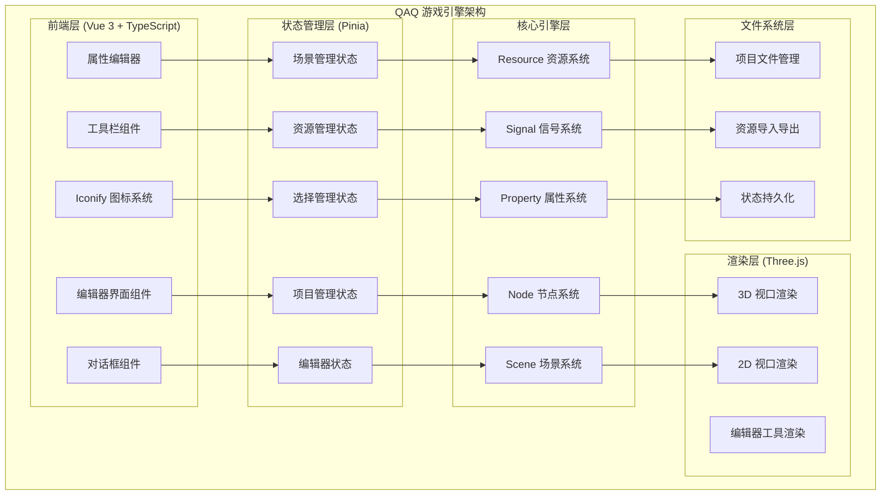
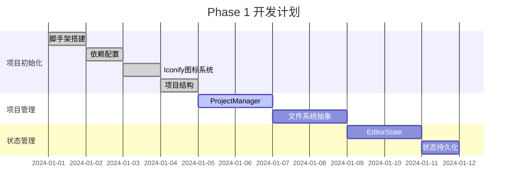

# QAQ 游戏引擎完整概览

## 🎯 项目总览

QAQ 是一个基于 Vue3 + Nuxt UI Pro + Pinia 技术栈的现代化游戏引擎编辑器，完全复刻 Godot 的核心架构和用户体验。

### 核心优先级 (按用户需求调整)

1. **🔥 项目创建/导入** - 最高优先级
2. **🔥 编辑器状态持久化** - 最高优先级  
3. **🔥 场景保存/加载** - 最高优先级
4. **🔥 资源管理器** - 最高优先级
5. **🎨 编辑器界面原型** - 高优先级
6. **🎮 Iconify 图标系统** - 高优先级 ✨

## 📊 项目架构图



## 🗂️ 完整文档结构

### 已创建的文档文件

```
qaq-game-engine/docs/
├── 📄 work-plan.md              # 详细工作计划 (12周开发计划)
├── 📄 detailed-tasks.md         # 任务细化拆分 (每日任务级别)
├── 📄 editor-design.md          # 编辑器界面设计原型
├── 📄 resource-system.md        # 资源管理系统详细设计
├── 📄 workflow-diagrams.md      # 工作流程图集合
├── 📄 project-structure.md      # 完整项目目录结构
├── 📄 iconify-system.md         # Iconify 图标系统设计 ✨
└── 📄 complete-overview.md      # 本文档 - 完整概览
```

### 核心设计亮点

#### 1. 编辑器界面设计 ✨
- **响应式布局**: 支持 1920px 到平板的自适应
- **可调整面板**: 左右面板宽度可调，底部面板可折叠
- **现代化UI**: 基于 Nuxt UI Pro 的现代设计语言
- **主题支持**: 深色/浅色主题切换

#### 2. Iconify 图标系统 🎨 ✨
- **200,000+ 图标**: 基于 Iconify 的海量图标库
- **智能分类**: 节点、文件、工具、菜单图标分类管理
- **按需加载**: 动态加载图标集合，优化性能
- **自定义图标**: 支持自定义 SVG 图标集合
- **统一接口**: QaqIcon 组件统一管理所有图标

#### 3. 项目管理系统 🗂️
- **项目创建向导**: 支持多种项目模板
- **项目导入验证**: 完整性检查和版本兼容
- **状态持久化**: 编辑器状态自动保存恢复
- **最近项目**: 快速访问最近使用的项目

#### 4. 资源管理系统 📦
- **多格式支持**: 图片、3D模型、音频、字体等
- **智能导入**: 自动识别文件类型和生成预览
- **依赖追踪**: 自动管理资源依赖关系
- **缓存优化**: 智能缓存和预加载机制

#### 5. 节点系统架构 🎮
- **完整继承体系**: Node → Node2D/Node3D → 具体节点类型
- **信号系统**: 类似 Godot 的事件通信机制
- **属性系统**: 动态属性管理和序列化
- **生命周期**: _ready, _process, _physics_process

## 🎨 Iconify 图标系统特色

### 图标分类系统
```typescript
// 节点图标 - 基于 material-symbols
'Node': 'material-symbols:radio-button-unchecked'
'Node2D': 'material-symbols:2d'
'Node3D': 'material-symbols:3d-rotation'
'Sprite2D': 'material-symbols:image-outline'
'Camera3D': 'material-symbols:videocam'

// 文件图标 - 基于 vscode-icons + material-symbols
'.tscn': 'material-symbols:scene'
'.js': 'vscode-icons:file-type-js-official'
'.png': 'vscode-icons:file-type-image'
'.glb': 'material-symbols:view-in-ar'

// 工具图标 - 基于 material-symbols
'select': 'material-symbols:mouse'
'move': 'material-symbols:open-with'
'rotate': 'material-symbols:rotate-90-degrees-ccw'
'scale': 'material-symbols:aspect-ratio'
```

### 核心技术栈
```typescript
// 图标相关依赖
{
  "@nuxt/icon": "^1.0.0",        // Nuxt 官方图标模块
  "@iconify/vue": "^4.1.0",      // Vue 3 Iconify 组件
  "@iconify/json": "^2.2.0",     // 图标数据包
  "unplugin-icons": "^0.18.0"    // Vite 图标插件
}
```

### 统一图标组件
```vue
<!-- 使用示例 -->
<QaqIcon name="Node2D" type="node" size="16" />
<QaqIcon name=".tscn" type="file" size="16" />
<QaqIcon name="select" type="tool" size="18" />
<QaqIcon name="file-new" type="menu" size="16" />
```

## 📋 开发里程碑

### Phase 1: 基础架构 (Week 1-2) ⭐⭐⭐


**核心交付物**:
- ✅ 完整的项目脚手架
- ✅ Iconify 图标系统集成 ✨
- ✅ 项目创建和导入功能
- ✅ 编辑器状态持久化系统
- ✅ 基础文件系统管理

### Phase 2: 核心系统 (Week 3-4) ⭐⭐⭐
**核心交付物**:
- ✅ 完整的 Node 节点系统
- ✅ 场景保存和加载功能
- ✅ 基础资源管理系统
- ✅ 信号和属性系统

### Phase 3: 编辑器界面 (Week 5-7) ⭐⭐⭐
**核心交付物**:
- ✅ 完整的编辑器主界面
- ✅ 所有核心面板功能
- ✅ 3D/2D 视口系统
- ✅ 基础编辑工具

## 🎯 界面原型展示

### 主编辑器界面 (带图标)
```
┌─────────────────────────────────────────────────────────────────────────────┐
│ 📁File 📝Edit 🚀Project 🎬Scene 🎮Node 🔨Build 🐛Debug ❓Help  ▶️⏸️⏹️ [Scene▼]⚙️│
├─────────────────────────────────────────────────────────────────────────────┤
│🎬Scene     │                                           │🔍Inspector         │
│├─🎮Player  │           3D/2D Viewport                  │┌─📍Transform       │
││├─🖼️Sprite │                                           ││Position: 0,0      │
││└─⚡Collision│      [🖱️Select][↔️Move][🔄Rotate][⤢Scale]  ││Rotation: 0°       │
│└─🌍World   │                                           ││Scale: 1,1         │
│ ├─🏠Background│                                        │└─🎨CanvasItem      │
│ └─🎯Enemies │                                          │ Visible: ✓        │
│            │                                           │ Modulate: ████    │
│📁FileSystem│                                           │🏷️Node              │
│├─📁scenes  │                                           │ Name: Player      │
│├─📜scripts │                                           │ Groups: [player]  │
│├─🎨assets  │                                           │                   │
│└─🎬Main.tscn│                                          │                   │
├─────────────────────────────────────────────────────────────────────────────┤
│📤Output 🐛Debugger 🎬Animation 🔊Audio                                       │
│[INFO] Project loaded successfully                                           │
│[INFO] Scene Main.tscn opened                                               │
└─────────────────────────────────────────────────────────────────────────────┘
```

## 🔧 技术实现要点

### 核心技术栈
```typescript
// 主要依赖 (更新版本)
{
  "vue": "^3.4.0",              // Vue 3 框架
  "@nuxt/ui-pro": "^1.0.0",     // UI 组件库
  "@nuxt/icon": "^1.0.0",       // Nuxt 图标模块 ✨
  "pinia": "^2.1.0",            // 状态管理
  "three": "^0.160.0",          // 3D 渲染
  "@iconify/vue": "^4.1.0",     // Iconify Vue 组件 ✨
  "@iconify/json": "^2.2.0"     // 图标数据包 ✨
}
```

### 图标系统架构
```typescript
// 图标管理 Store
interface IconSystemStore {
  loadedCollections: Set<string>     // 已加载的图标集合
  iconCache: Map<string, string>     // 图标缓存
  customIcons: Map<string, IconData> // 自定义图标
}

// 图标组件架构
QaqIcon                    // 统一图标组件
├── NodeIcon              // 节点图标
├── FileIcon              // 文件图标
├── ToolIcon              // 工具图标
└── IconPickerDialog      // 图标选择器
```

## 🚀 快速开始

### 1. 环境准备
```bash
# 克隆项目
git clone <repository-url>
cd qaq-game-engine

# 安装依赖 (包含 Iconify)
npm install

# 启动开发服务器
npm run dev
```

### 2. 图标系统使用
```vue
<!-- 在组件中使用图标 -->
<template>
  <div class="editor-toolbar">
    <QaqIcon name="select" type="tool" />
    <QaqIcon name="move" type="tool" />
    <QaqIcon name="Node2D" type="node" />
  </div>
</template>
```

## 📈 成功指标

### 功能完整性
- ✅ 项目创建/导入 100% 可用
- ✅ 编辑器状态完全持久化
- ✅ 场景保存/加载无损
- ✅ 资源管理器功能完整
- ✅ Iconify 图标系统完整集成 ✨
- ✅ 基础编辑工具可用

### 图标系统指标 ✨
- 🎯 图标加载时间 < 100ms
- 🎯 支持 200,000+ 图标
- 🎯 图标缓存命中率 > 90%
- 🎯 自定义图标支持完整

### 性能指标
- 🎯 编辑器启动时间 < 3秒
- 🎯 场景加载时间 < 1秒
- 🎯 界面响应时间 < 100ms
- 🎯 内存使用 < 500MB

这个完整概览展示了 QAQ 游戏引擎的全貌，特别突出了新增的 Iconify 图标系统，为编辑器提供了丰富的视觉体验和现代化的用户界面！
