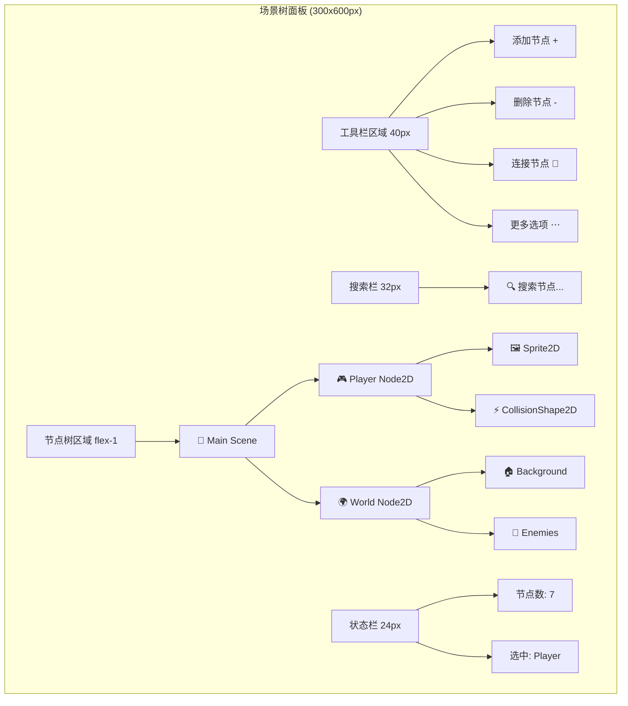
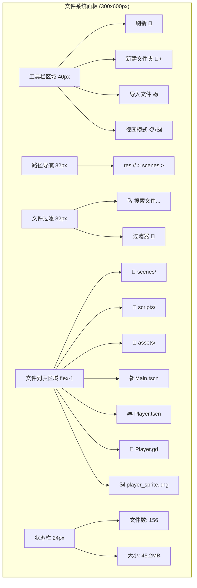
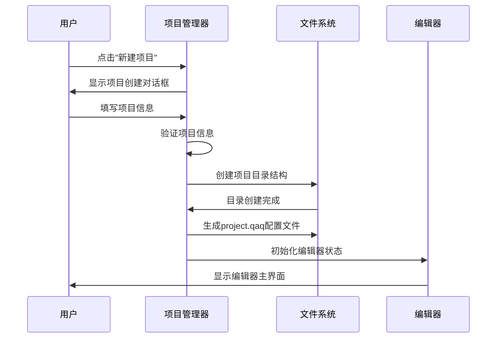
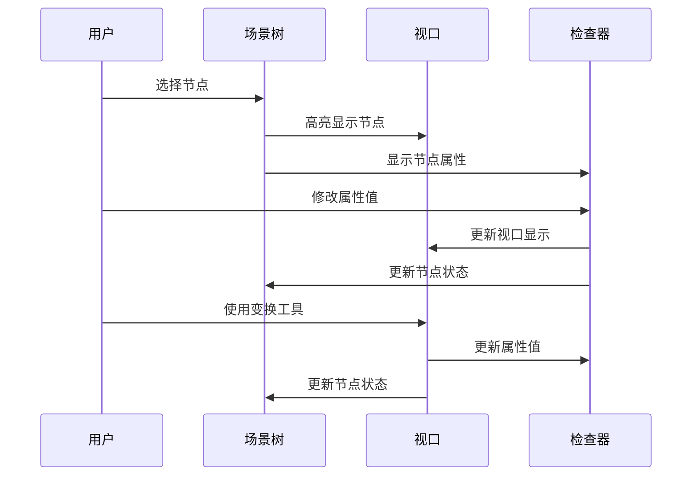
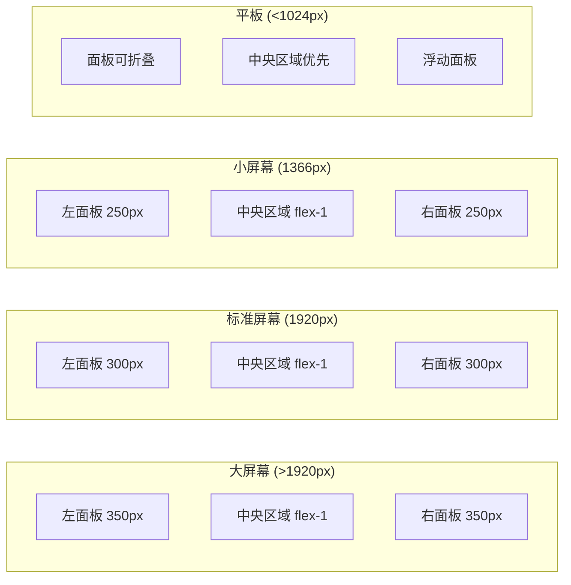

# QAQ 编辑器界面设计原型

## 🎨 编辑器主界面设计

### 整体布局结构

```mermaid
graph TB
    subgraph "QAQ编辑器主界面 (1920x1080)"
        subgraph "顶部菜单栏 (高度: 40px)"
            A1[File] --> A2[Edit] --> A3[Project] --> A4[Scene] --> A5[Node] --> A6[Build] --> A7[Debug] --> A8[Help]
            A9[运行按钮组] --> A10[场景选择器] --> A11[设置按钮]
        end
        
        subgraph "主工作区域 (高度: 960px)"
            subgraph "左侧面板 (宽度: 300px)"
                B1[场景树 Scene]
                B2[导入 Import] 
                B3[文件系统 FileSystem]
                B4[节点库 NodeLib]
            end
            
            subgraph "中央视口区 (flex-1, 约1320px)"
                C1[场景标签页区域]
                C2[主视口 (3D/2D)]
                C3[视口工具栏]
                C4[状态栏]
            end
            
            subgraph "右侧面板 (宽度: 300px)"
                D1[检查器 Inspector]
                D2[节点信息 Node]
                D3[组管理 Groups]
                D4[历史记录 History]
            end
        end
        
        subgraph "底部面板 (高度: 200px - 可折叠)"
            E1[输出 Output] --> E2[调试器 Debugger] --> E3[动画 Animation] --> E4[音频 Audio] --> E5[网络 Network]
        end
    end
```

## 🔧 核心面板详细设计

### 1. 场景树面板 (SceneTreeDock)



#### 场景树交互功能
- **节点选择**: 单击选中，Ctrl+单击多选，Shift+单击范围选择
- **节点拖拽**: 拖拽重新排列节点层次结构
- **右键菜单**: 
  - 添加子节点
  - 复制/粘贴节点
  - 删除节点
  - 重命名节点
  - 更改节点类型
  - 设为主场景
- **节点图标**: 根据节点类型显示对应图标和颜色
- **节点状态**: 显示节点的可见性、锁定状态等

### 2. 属性检查器面板 (InspectorDock)

```mermaid
graph TD
    subgraph "检查器面板 (300x800px)"
        A[节点信息区 60px]
        A --> A1[节点名称: Player]
        A --> A2[节点类型: Node2D]
        A --> A3[节点ID: #12345]
        
        B[属性搜索 32px]
        B --> B1[🔍 搜索属性...]
        
        C[属性分组区域 flex-1]
        C --> C1[📍 Transform]
        C1 --> C11[Position: Vector2(0, 0)]
        C1 --> C12[Rotation: 0°]
        C1 --> C13[Scale: Vector2(1, 1)]
        
        C --> C2[🎨 CanvasItem]
        C2 --> C21[Visible: ✓]
        C2 --> C22[Modulate: Color(1,1,1,1)]
        C2 --> C23[Z Index: 0]
        
        C --> C3[🏷️ Node]
        C3 --> C31[Name: Player]
        C3 --> C32[Process Mode: Inherit]
        C3 --> C33[Groups: [player, entity]]
        
        D[操作按钮区 40px]
        D --> D1[重置属性]
        D --> D2[复制属性]
        D --> D3[粘贴属性]
    end
```

#### 属性编辑器类型
- **Boolean**: 复选框
- **Number**: 数字输入框，支持拖拽调整
- **String**: 文本输入框
- **Vector2/Vector3**: 多个数字输入框组合
- **Color**: 颜色选择器
- **Enum**: 下拉选择框
- **Resource**: 资源选择器，支持拖拽
- **Array**: 可展开的数组编辑器

### 3. 文件系统面板 (FileSystemDock)



#### 文件系统功能
- **文件类型图标**: 根据文件扩展名显示对应图标
- **文件预览**: 鼠标悬停显示文件预览
- **拖拽操作**: 支持文件拖拽到场景或其他面板
- **右键菜单**:
  - 新建文件/文件夹
  - 重命名
  - 删除
  - 复制路径
  - 在资源管理器中显示
  - 重新导入
- **文件状态**: 显示文件的导入状态、修改状态等

### 4. 中央视口区域设计

```mermaid
graph TD
    subgraph "中央视口区域 (1320x960px)"
        A[场景标签栏 32px]
        A --> A1[Main.tscn ×]
        A --> A2[Player.tscn ×]
        A --> A3[+ 新建场景]
        
        B[视口工具栏 40px]
        B --> B1[选择工具 🔘]
        B --> B2[移动工具 ↔️]
        B --> B3[旋转工具 🔄]
        B --> B4[缩放工具 ⤢]
        B --> B5[|]
        B --> B6[2D/3D切换]
        B --> B7[网格显示 #]
        B --> B8[捕捉 🧲]
        
        C[主视口区域 flex-1]
        C --> C1[3D场景渲染区域]
        C1 --> C11[相机控制提示]
        C1 --> C12[坐标轴指示器]
        C1 --> C13[选中对象高亮]
        C1 --> C14[变换Gizmo]
        
        D[视口状态栏 24px]
        D --> D1[FPS: 60]
        D --> D2[Objects: 156]
        D --> D3[Vertices: 2.1K]
        D --> D4[相机位置: (0,0,5)]
    end
```

#### 视口交互功能
- **相机控制**:
  - 鼠标中键: 平移
  - 鼠标右键: 旋转
  - 滚轮: 缩放
  - F键: 聚焦到选中对象
- **对象选择**:
  - 单击选择
  - 框选多选
  - Ctrl+单击切换选择
- **变换工具**:
  - 移动Gizmo: XYZ轴向移动
  - 旋转Gizmo: 绕轴旋转
  - 缩放Gizmo: 等比或分轴缩放

## 🎯 用户交互流程设计

### 项目创建流程



### 场景编辑流程



## 📱 响应式设计适配

### 不同屏幕尺寸适配



### 面板自适应规则
- **最小宽度**: 左右面板最小200px
- **折叠阈值**: 屏幕宽度<1024px时面板可折叠
- **优先级**: 中央视口 > 检查器 > 场景树 > 文件系统
- **记忆功能**: 保存用户的面板布局偏好

## 🎨 主题和样式设计

### 颜色方案

#### 深色主题 (默认)
```css
:root {
  --bg-primary: #2b2b2b;      /* 主背景 */
  --bg-secondary: #3c3c3c;    /* 面板背景 */
  --bg-tertiary: #4a4a4a;     /* 工具栏背景 */
  --text-primary: #ffffff;     /* 主文本 */
  --text-secondary: #cccccc;   /* 次要文本 */
  --text-muted: #999999;       /* 禁用文本 */
  --border: #555555;           /* 边框颜色 */
  --accent: #4a9eff;           /* 强调色 */
  --success: #4caf50;          /* 成功色 */
  --warning: #ff9800;          /* 警告色 */
  --error: #f44336;            /* 错误色 */
}
```

#### 浅色主题
```css
:root[data-theme="light"] {
  --bg-primary: #ffffff;
  --bg-secondary: #f5f5f5;
  --bg-tertiary: #eeeeee;
  --text-primary: #333333;
  --text-secondary: #666666;
  --text-muted: #999999;
  --border: #dddddd;
  --accent: #2196f3;
  --success: #4caf50;
  --warning: #ff9800;
  --error: #f44336;
}
```

### 节点类型颜色编码
- **Node**: `#ffffff` (白色)
- **Node2D**: `#8da5f3` (蓝色)
- **Node3D**: `#fc7f7f` (红色)
- **Control**: `#a5efac` (绿色)
- **CanvasItem**: `#8da5f3` (蓝色)
- **RigidBody**: `#f77070` (橙红色)
- **Area**: `#7582d1` (紫蓝色)
- **AudioStreamPlayer**: `#eac968` (黄色)
- **AnimationPlayer**: `#eac968` (黄色)

## 🔧 技术实现要点

### 组件架构
```
EditorLayout
├── EditorMenuBar
├── EditorMainArea
│   ├── LeftPanelContainer
│   │   ├── SceneTreeDock
│   │   ├── FileSystemDock
│   │   └── ImportDock
│   ├── CenterViewportArea
│   │   ├── SceneTabBar
│   │   ├── ViewportToolbar
│   │   ├── EditorViewport3D
│   │   └── ViewportStatusBar
│   └── RightPanelContainer
│       ├── InspectorDock
│       ├── NodeDock
│       └── GroupsDock
└── BottomPanelContainer
    ├── OutputDock
    ├── DebuggerDock
    └── AnimationDock
```

### 状态管理结构
```typescript
// 编辑器状态管理
interface EditorState {
  layout: {
    leftPanel: { width: number, visible: boolean, activeTab: string }
    rightPanel: { width: number, visible: boolean, activeTab: string }
    bottomPanel: { height: number, visible: boolean, activeTab: string }
  }
  viewport: {
    mode: '2D' | '3D'
    tool: 'select' | 'move' | 'rotate' | 'scale'
    camera: CameraState
    grid: GridState
  }
  selection: {
    nodes: string[]
    lastSelected: string | null
  }
  scenes: {
    openScenes: SceneTab[]
    currentScene: string | null
  }
}
```

这个设计提供了完整的编辑器界面原型，包含了所有核心功能的详细交互设计和技术实现要点。
