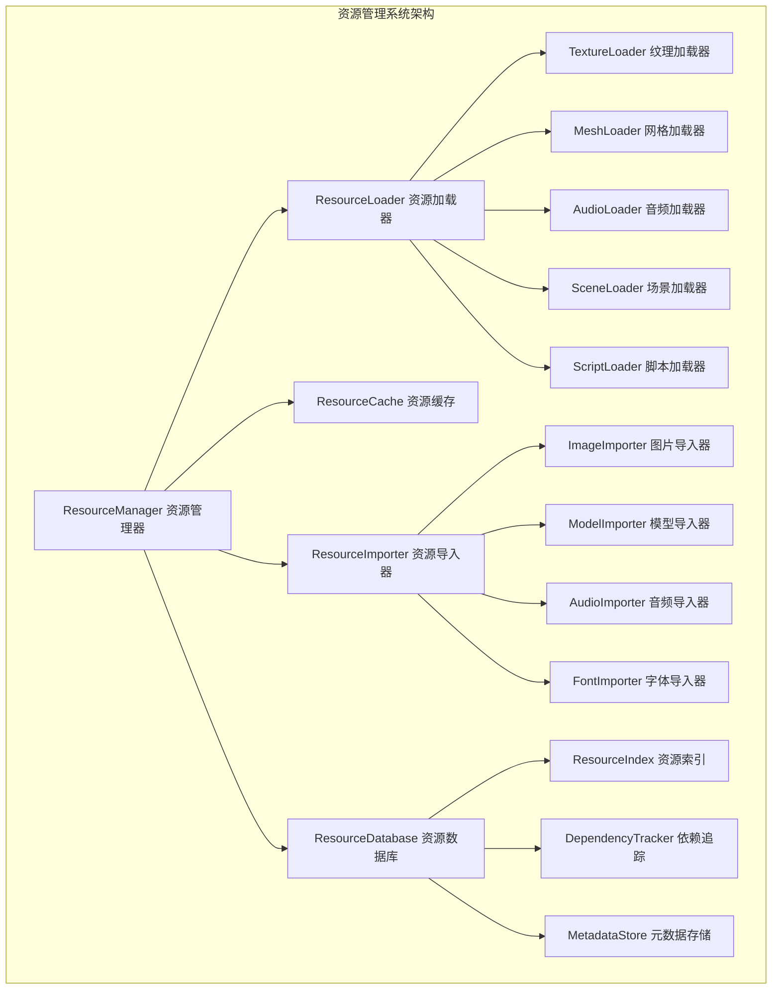
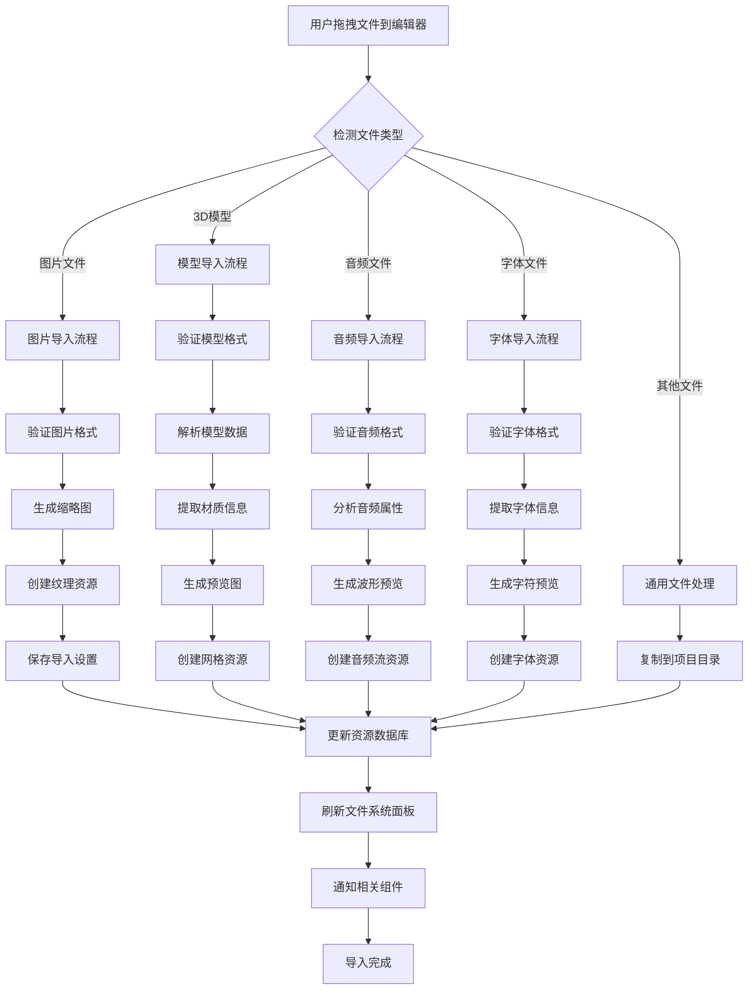
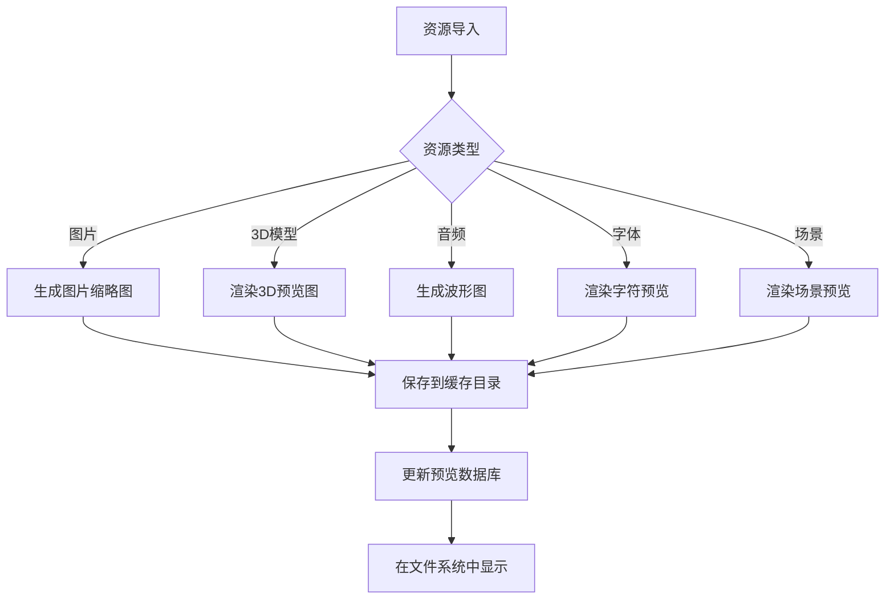
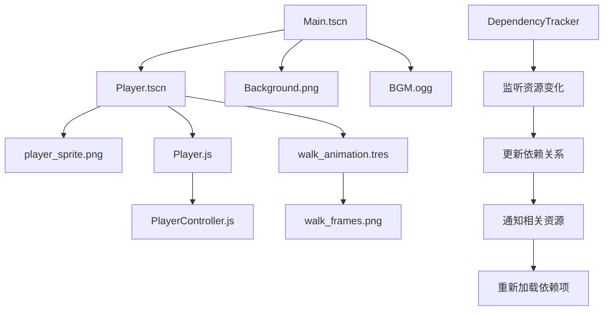

# QAQ 资源管理系统详细设计

## 📦 资源系统架构

### 资源管理器核心结构



## 🗂️ 项目文件结构

### 标准项目目录结构

```
MyGame/                          # 项目根目录
├── project.qaq                  # 项目配置文件
├── .qaq/                        # 编辑器数据目录
│   ├── editor/                  # 编辑器状态
│   │   ├── editor_state.json    # 编辑器状态
│   │   ├── recent_files.json    # 最近文件
│   │   └── layout.json          # 界面布局
│   ├── imported/                # 导入资源缓存
│   │   ├── textures/            # 纹理缓存
│   │   ├── models/              # 模型缓存
│   │   └── audio/               # 音频缓存
│   └── cache/                   # 其他缓存
│       ├── resource_index.db    # 资源索引数据库
│       └── thumbnails/          # 缩略图缓存
├── scenes/                      # 场景文件
│   ├── Main.tscn               # 主场景
│   ├── Player.tscn             # 玩家场景
│   └── UI/                     # UI场景
│       ├── MainMenu.tscn
│       └── GameHUD.tscn
├── scripts/                     # 脚本文件
│   ├── Player.js               # 玩家脚本
│   ├── Enemy.js                # 敌人脚本
│   └── GameManager.js          # 游戏管理器
├── assets/                      # 资源文件
│   ├── textures/               # 纹理资源
│   │   ├── characters/         # 角色纹理
│   │   ├── environment/        # 环境纹理
│   │   └── ui/                 # UI纹理
│   ├── models/                 # 3D模型
│   │   ├── characters/         # 角色模型
│   │   └── props/              # 道具模型
│   ├── audio/                  # 音频资源
│   │   ├── music/              # 背景音乐
│   │   ├── sfx/                # 音效
│   │   └── voice/              # 语音
│   ├── fonts/                  # 字体文件
│   └── data/                   # 数据文件
│       ├── levels/             # 关卡数据
│       └── configs/            # 配置文件
└── exports/                     # 导出文件
    ├── web/                    # Web导出
    ├── desktop/                # 桌面导出
    └── mobile/                 # 移动端导出
```

## 🔄 资源导入流程

### 资源导入详细流程



## 📋 支持的资源类型

### 图片资源 (Texture)

```typescript
interface TextureResource extends Resource {
  type: 'texture'
  format: 'png' | 'jpg' | 'jpeg' | 'webp' | 'bmp' | 'tga'
  width: number
  height: number
  channels: number
  hasAlpha: boolean
  importSettings: {
    filter: boolean           // 是否启用过滤
    mipmaps: boolean         // 是否生成Mipmap
    compression: 'none' | 'lossless' | 'lossy'
    maxSize: number          // 最大尺寸
  }
}
```

**支持格式**:
- `.png` - PNG图片 (推荐，支持透明)
- `.jpg/.jpeg` - JPEG图片 (适合照片)
- `.webp` - WebP图片 (现代格式，体积小)
- `.bmp` - 位图文件
- `.tga` - Targa图片

**导入选项**:
- **过滤模式**: 线性过滤 / 最近邻过滤
- **Mipmap生成**: 自动生成多级纹理
- **压缩设置**: 无压缩 / 无损压缩 / 有损压缩
- **尺寸限制**: 最大纹理尺寸限制

### 3D模型资源 (Mesh)

```typescript
interface MeshResource extends Resource {
  type: 'mesh'
  format: 'glb' | 'gltf' | 'fbx' | 'obj' | 'dae'
  vertices: number
  triangles: number
  materials: MaterialInfo[]
  animations: AnimationInfo[]
  importSettings: {
    scale: number            // 缩放比例
    generateNormals: boolean // 生成法线
    generateTangents: boolean // 生成切线
    optimizeMesh: boolean    // 网格优化
  }
}
```

**支持格式**:
- `.glb/.gltf` - glTF 2.0格式 (推荐，现代标准)
- `.fbx` - Autodesk FBX格式
- `.obj` - Wavefront OBJ格式
- `.dae` - COLLADA格式

**导入选项**:
- **缩放设置**: 导入时的缩放比例
- **法线生成**: 自动生成顶点法线
- **切线生成**: 生成切线用于法线贴图
- **网格优化**: 顶点合并和索引优化
- **动画导入**: 骨骼动画和变形动画

### 音频资源 (AudioStream)

```typescript
interface AudioStreamResource extends Resource {
  type: 'audio'
  format: 'wav' | 'mp3' | 'ogg' | 'aac'
  duration: number
  sampleRate: number
  channels: number
  bitRate: number
  importSettings: {
    loop: boolean            // 是否循环
    compression: 'none' | 'vorbis' | 'mp3'
    quality: number          // 压缩质量 0-1
  }
}
```

**支持格式**:
- `.wav` - WAV音频 (无损，适合音效)
- `.mp3` - MP3音频 (有损压缩)
- `.ogg` - OGG Vorbis (开源有损压缩)
- `.aac` - AAC音频 (高效压缩)

**导入选项**:
- **循环设置**: 音频是否循环播放
- **压缩格式**: 选择压缩算法
- **质量设置**: 压缩质量平衡

### 字体资源 (Font)

```typescript
interface FontResource extends Resource {
  type: 'font'
  format: 'ttf' | 'otf' | 'woff2'
  family: string
  style: string
  weight: number
  importSettings: {
    size: number             // 默认字体大小
    antialiasing: boolean    // 抗锯齿
    hinting: 'none' | 'light' | 'normal'
  }
}
```

**支持格式**:
- `.ttf` - TrueType字体
- `.otf` - OpenType字体
- `.woff2` - Web字体格式

### 场景资源 (PackedScene)

```typescript
interface PackedSceneResource extends Resource {
  type: 'scene'
  format: 'tscn' | 'scn'
  rootNode: string
  nodeCount: number
  dependencies: string[]
  importSettings: {
    editable: boolean        // 是否可编辑实例
    storage: 'text' | 'binary'
  }
}
```

## 🔍 资源预览系统

### 缩略图生成



### 预览功能特性

#### 图片预览
- **缩略图**: 128x128像素预览图
- **详细信息**: 尺寸、格式、文件大小
- **颜色分析**: 主要颜色提取
- **透明度检测**: 是否包含透明通道

#### 3D模型预览
- **3D缩略图**: 旋转预览图
- **网格信息**: 顶点数、三角形数
- **材质列表**: 使用的材质信息
- **动画列表**: 包含的动画信息

#### 音频预览
- **波形显示**: 音频波形可视化
- **播放控制**: 预览播放功能
- **音频信息**: 时长、采样率、声道
- **音量分析**: 音量包络显示

## 🔗 资源依赖管理

### 依赖关系追踪



### 依赖管理功能

#### 自动依赖检测
- **场景依赖**: 自动检测场景中使用的资源
- **脚本依赖**: 分析脚本中引用的资源
- **材质依赖**: 材质使用的纹理资源
- **动画依赖**: 动画使用的纹理和音频

#### 依赖完整性检查
- **缺失资源检测**: 检查引用但不存在的资源
- **循环依赖检测**: 防止资源循环引用
- **依赖路径验证**: 确保资源路径正确
- **版本兼容性**: 检查资源版本兼容性

#### 依赖管理操作
- **查找引用**: 查找使用某个资源的所有地方
- **替换资源**: 批量替换资源引用
- **清理未使用**: 清理项目中未使用的资源
- **依赖导出**: 导出时自动包含依赖资源

## 📊 资源数据库

### 资源索引结构

```typescript
interface ResourceIndex {
  resources: Map<string, ResourceEntry>
  dependencies: Map<string, string[]>
  reverseDependencies: Map<string, string[]>
  tags: Map<string, string[]>
  lastUpdate: number
}

interface ResourceEntry {
  path: string
  type: ResourceType
  size: number
  lastModified: number
  checksum: string
  metadata: ResourceMetadata
  thumbnail?: string
}
```

### 数据库操作

#### 索引维护
- **增量更新**: 只更新变化的资源
- **完整性检查**: 定期验证索引完整性
- **自动修复**: 自动修复损坏的索引
- **备份恢复**: 索引备份和恢复机制

#### 搜索功能
- **全文搜索**: 支持资源名称和标签搜索
- **类型过滤**: 按资源类型过滤
- **大小过滤**: 按文件大小范围过滤
- **日期过滤**: 按修改日期过滤
- **标签搜索**: 基于用户标签搜索

## 🚀 性能优化

### 资源加载优化

#### 异步加载
```typescript
class ResourceManager {
  async loadResource(path: string): Promise<Resource> {
    // 检查缓存
    if (this.cache.has(path)) {
      return this.cache.get(path)
    }
    
    // 异步加载
    const resource = await this.loadFromDisk(path)
    
    // 缓存资源
    this.cache.set(path, resource)
    
    return resource
  }
  
  preloadResources(paths: string[]): Promise<void[]> {
    return Promise.all(paths.map(path => this.loadResource(path)))
  }
}
```

#### 缓存策略
- **LRU缓存**: 最近最少使用缓存策略
- **内存限制**: 设置最大内存使用量
- **智能预加载**: 预测性资源预加载
- **后台清理**: 后台清理未使用资源

#### 批量操作
- **批量导入**: 同时导入多个文件
- **批量处理**: 批量生成缩略图
- **批量验证**: 批量验证资源完整性
- **批量更新**: 批量更新资源索引

这个资源管理系统提供了完整的资源处理流程，从导入到使用的全生命周期管理，确保项目资源的高效管理和使用。
