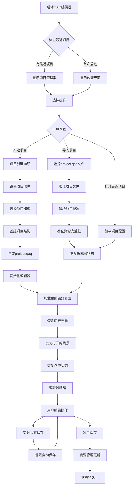
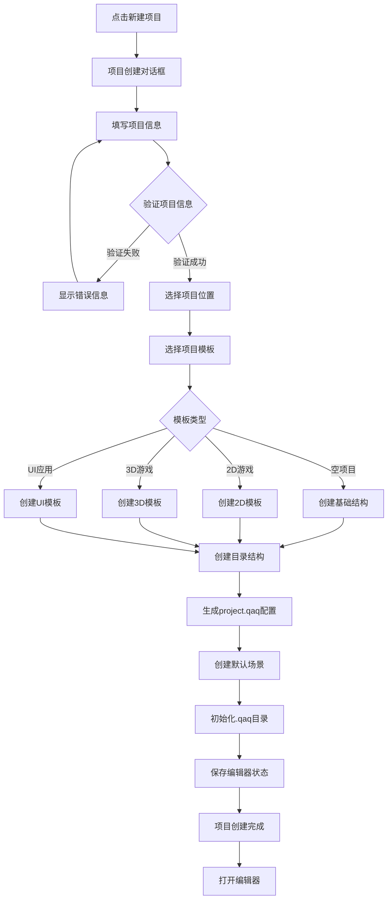
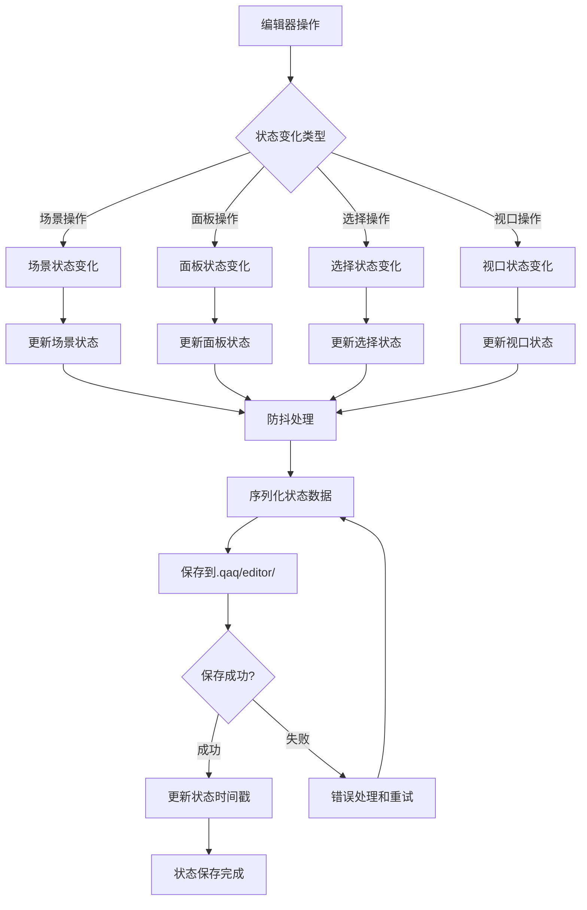
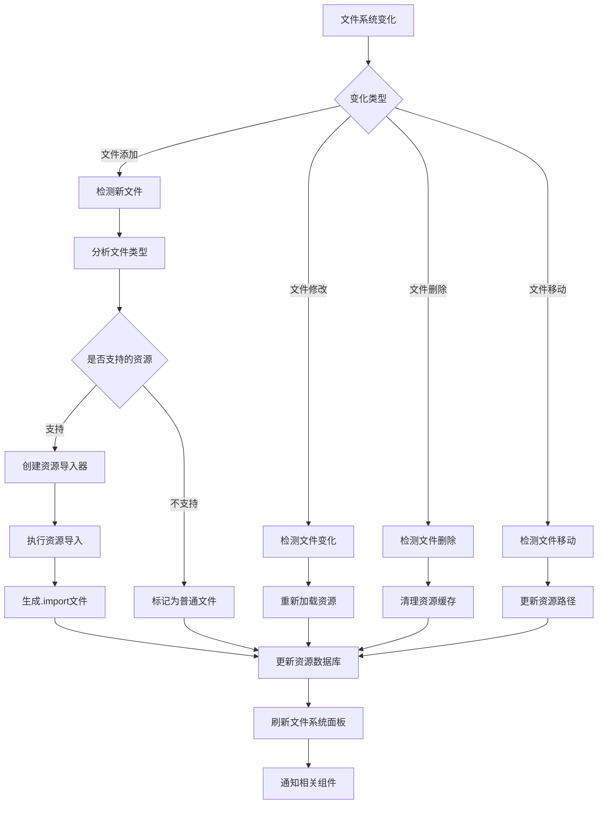

# QAQ 编辑器工作流程图

## 1. 整体工作流程

```mermaid
flowchart TD
    A[启动QAQ编辑器] --> B{检查最近项目}
    B -->|有最近项目| C[显示项目管理器]
    B -->|首次启动| D[显示欢迎界面]
    
    C --> E[选择操作]
    D --> E
    
    E --> F{用户选择}
    F -->|新建项目| G[项目创建向导]
    F -->|导入项目| H[选择project.qaq文件]
    F -->|打开最近项目| I[加载项目配置]
    
    G --> G1[设置项目信息]
    G1 --> G2[选择项目模板]
    G2 --> G3[创建项目结构]
    G3 --> G4[生成project.qaq]
    G4 --> J[初始化编辑器]
    
    H --> H1[验证项目文件]
    H1 --> H2[解析项目配置]
    H2 --> H3[检查资源完整性]
    H3 --> K[恢复编辑器状态]
    
    I --> K
    J --> L[加载主编辑器界面]
    K --> L
    
    L --> M[恢复面板布局]
    M --> N[恢复打开的场景]
    N --> O[恢复选中状态]
    O --> P[编辑器就绪]
    
    P --> Q[用户编辑操作]
    Q --> R[实时状态保存]
    R --> S[场景自动保存]
    S --> Q
    
    Q --> T[项目保存]
    T --> U[资源管理更新]
    U --> V[状态持久化]
```

## 2. 项目创建详细流程

```mermaid
flowchart TD
    A[点击新建项目] --> B[项目创建对话框]
    B --> C[填写项目信息]
    C --> D{验证项目信息}
    D -->|验证失败| E[显示错误信息]
    E --> C
    D -->|验证成功| F[选择项目位置]
    F --> G[选择项目模板]
    G --> H{模板类型}
    
    H -->|空项目| I[创建基础结构]
    H -->|2D游戏| J[创建2D模板]
    H -->|3D游戏| K[创建3D模板]
    H -->|UI应用| L[创建UI模板]
    
    I --> M[创建目录结构]
    J --> M
    K --> M
    L --> M
    
    M --> N[生成project.qaq配置]
    N --> O[创建默认场景]
    O --> P[初始化.qaq目录]
    P --> Q[保存编辑器状态]
    Q --> R[项目创建完成]
    R --> S[打开编辑器]
```

## 3. 编辑器状态持久化流程

```mermaid
flowchart TD
    A[编辑器操作] --> B{状态变化类型}
    
    B -->|场景操作| C[场景状态变化]
    B -->|面板操作| D[面板状态变化]
    B -->|选择操作| E[选择状态变化]
    B -->|视口操作| F[视口状态变化]
    
    C --> G[更新场景状态]
    D --> H[更新面板状态]
    E --> I[更新选择状态]
    F --> J[更新视口状态]
    
    G --> K[防抖处理]
    H --> K
    I --> K
    J --> K
    
    K --> L[序列化状态数据]
    L --> M[保存到.qaq/editor/]
    M --> N{保存成功?}
    N -->|成功| O[更新状态时间戳]
    N -->|失败| P[错误处理和重试]
    P --> L
    O --> Q[状态保存完成]
```

## 4. 资源管理系统流程

```mermaid
flowchart TD
    A[文件系统变化] --> B{变化类型}
    
    B -->|文件添加| C[检测新文件]
    B -->|文件修改| D[检测文件变化]
    B -->|文件删除| E[检测文件删除]
    B -->|文件移动| F[检测文件移动]
    
    C --> G[分析文件类型]
    D --> H[重新加载资源]
    E --> I[清理资源缓存]
    F --> J[更新资源路径]
    
    G --> K{是否支持的资源}
    K -->|支持| L[创建资源导入器]
    K -->|不支持| M[标记为普通文件]
    
    L --> N[执行资源导入]
    N --> O[生成.import文件]
    O --> P[更新资源数据库]
    
    H --> P
    I --> P
    J --> P
    M --> P
    
    P --> Q[刷新文件系统面板]
    Q --> R[通知相关组件]
```
